# CodeCompass – AI-Powered Java Code Analysis Platform

CodeCompass is an AI-powered Java code analysis platform designed to help developers understand and explore the structure of a Java codebase. It analyzes a GitHub repository and presents useful visualizations and insights through a web-based interface.

## 🚀 Key Features

### 📐 Architecture Map
Visualizes detected classes and organizes them into architectural categories to make the overall structure easier to understand.

### 🔗 Dependency Graph
Displays relationships between classes so developers can understand how different parts of the codebase depend on each other.

### 🔄 Method Call Flow
Explores method-level call relationships for selected API endpoints and presents the call flow as a visual tree.

### 📊 Code Metrics
Provides code-related metrics to help understand the size and characteristics of the analyzed codebase.

### 🤖 AI-Powered Code Analysis
Uses a local Ollama-based AI model to provide code analysis and repository-related explanations.

### 🐙 GitHub Repository Analysis
Analyzes Java source files from a GitHub repository without requiring the repository to be manually cloned into the application.

## 📸 Screenshots

### Dashboard

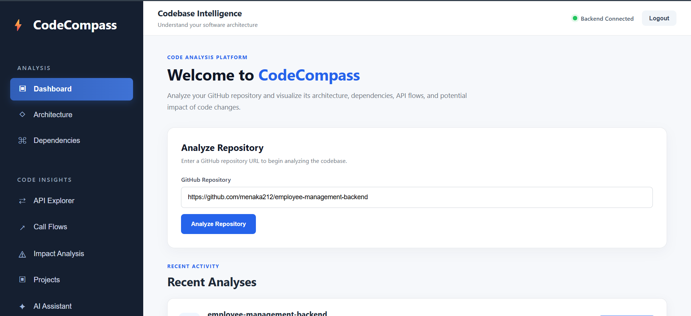
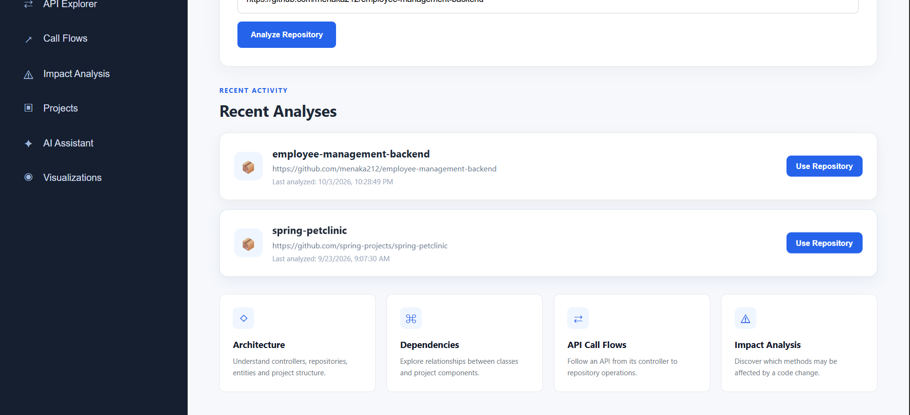

### Architecture Map

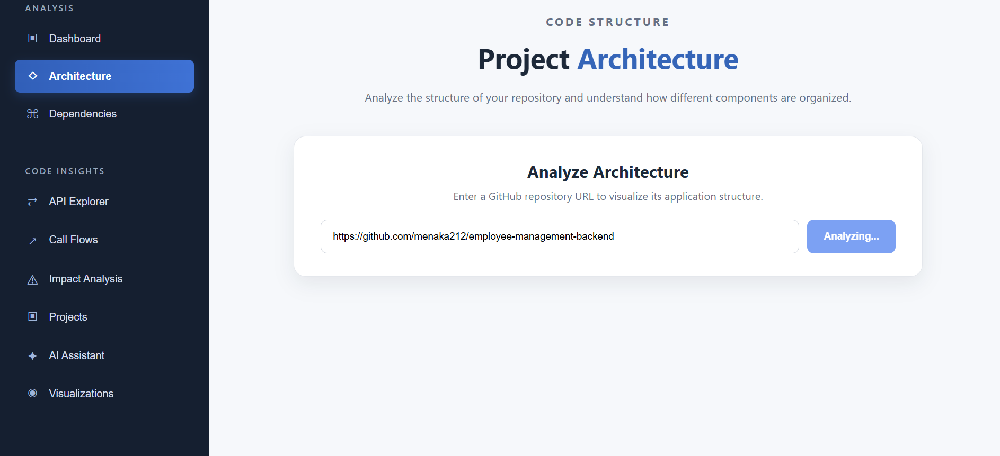
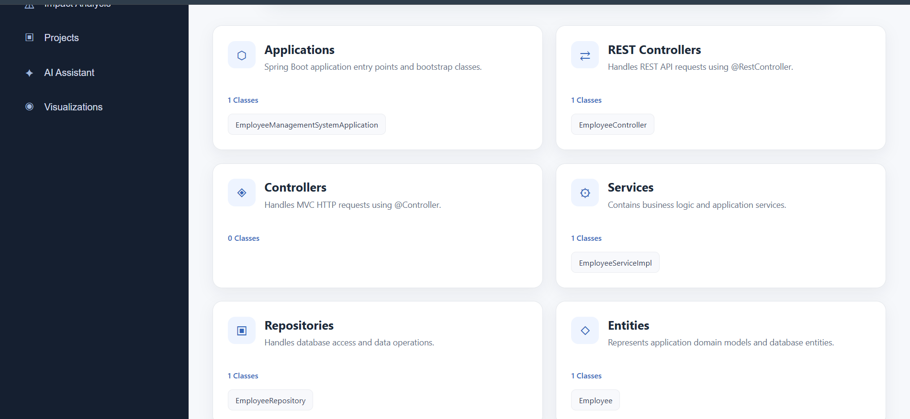

### Dependencies

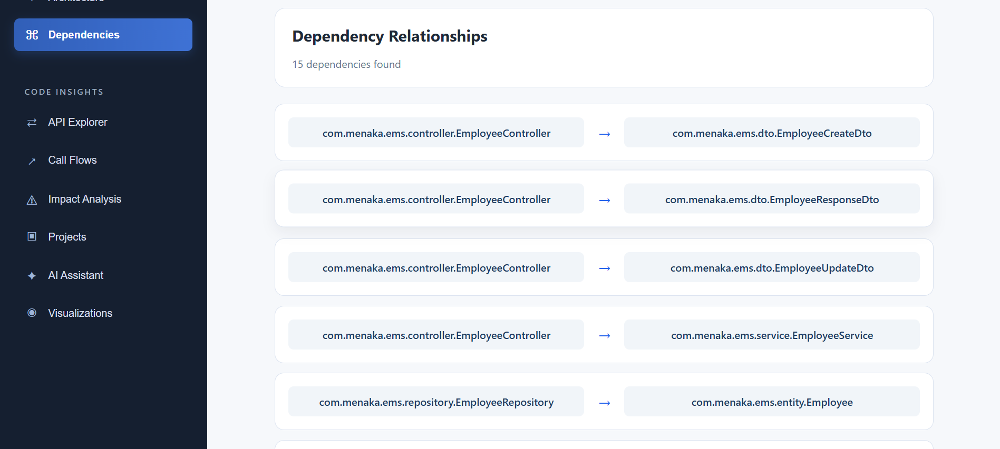

### API Explorer

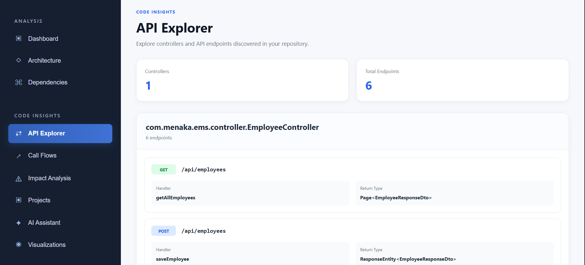

### Call Flows

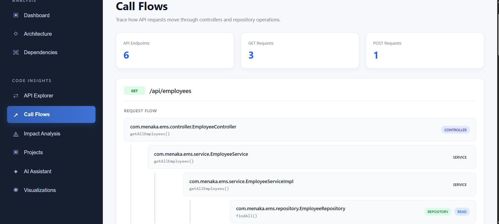

### Impact Analysis

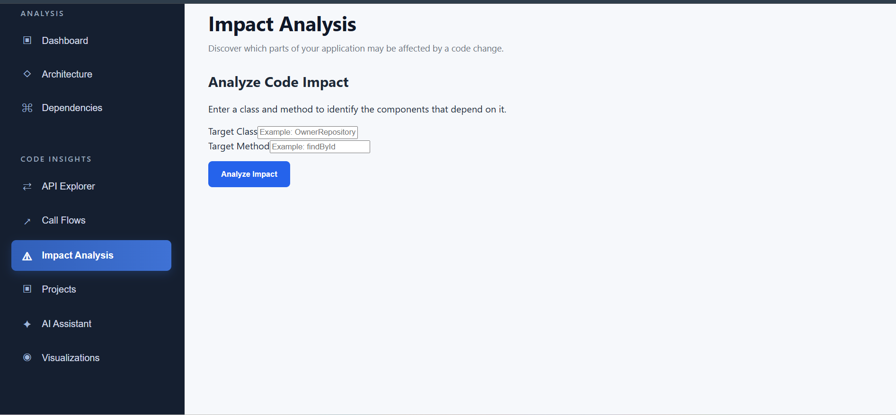

### Projects of the User

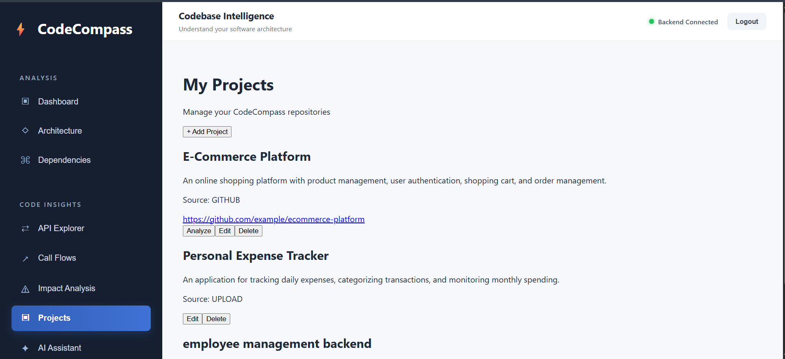

### AI Code Assistant

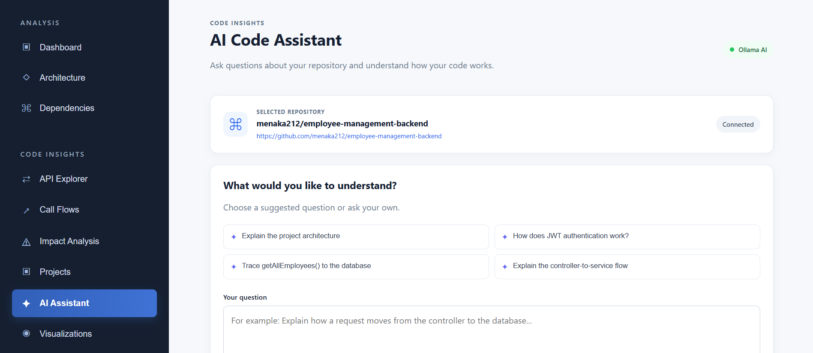

### Visualization

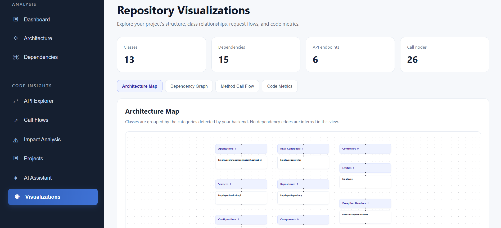
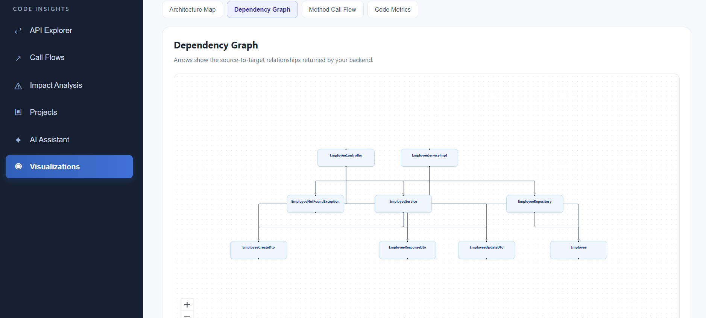
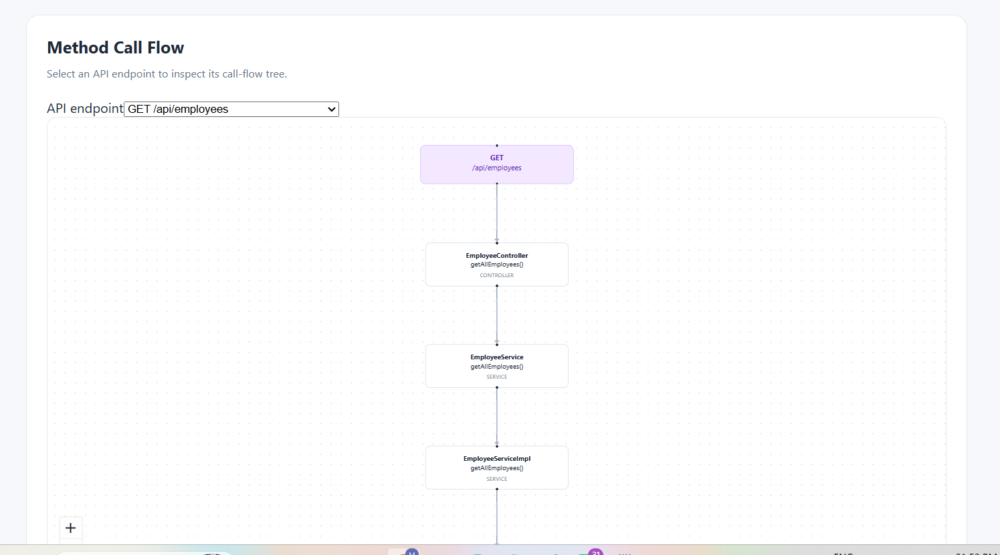

## 🛠️ Tech Stack

### Backend
- Java
- Spring Boot
- Spring Data JPA
- Spring Security
- JWT Authentication
- PostgreSQL
- GitHub API
- Ollama

### Frontend
- React
- TypeScript
- Vite
- React Flow
- Recharts
- Dagre

## 📁 Project Structure

```text
CodeCompass/
├── backend/
│   ├── src/
│   │   ├── main/
│   │   │   ├── java/
│   │   │   └── resources/
│   │   └── test/
│   ├── pom.xml
│   └── ...
├── frontend/
│   ├── src/
│   │   ├── pages/
│   │   ├── components/
│   │   └── ...
│   ├── package.json
│   └── ...
├── .gitignore
└── README.md
```

## ⚙️ Prerequisites

Make sure the following are installed:

- Java
- Maven
- Node.js
- npm
- PostgreSQL
- Ollama

You also need a GitHub Personal Access Token if authenticated GitHub API access is required.

## 🔐 Environment Configuration

Sensitive configuration should **not** be committed to GitHub.

Create your local:

```text
backend/src/main/resources/application.properties
```

using:

```text
backend/src/main/resources/application.properties.example
```

Example configuration:

```properties
spring.datasource.url=jdbc:postgresql://localhost:5432/codecompass_db
spring.datasource.username=postgres
spring.datasource.password=${DB_PASSWORD}

jwt.secret=${JWT_SECRET}
github.token=${GITHUB_TOKEN}

ollama.base-url=http://localhost:11434
ollama.model=llama3.2:1b
```

Set the required environment variables locally:

```text
DB_PASSWORD
JWT_SECRET
GITHUB_TOKEN
```

**Never commit real passwords, API tokens, JWT secrets, or other credentials.**

## ▶️ Running the Backend

Navigate to the backend:

```bash
cd backend
```

Run with Maven:

```bash
./mvnw spring-boot:run
```

On Windows:

```powershell
.\mvnw.cmd spring-boot:run
```

## ▶️ Running the Frontend

Open another terminal:

```bash
cd frontend
npm install
npm run dev
```

Open the URL displayed by Vite in your browser.

## 🤖 Running Ollama

Make sure Ollama is running locally and the configured model is available.

Current development configuration:

```text
http://localhost:11434
llama3.2:1b
```

## 🔍 Typical Workflow

1. Start PostgreSQL.
2. Start Ollama and make sure the configured model is available.
3. Start the CodeCompass Spring Boot backend.
4. Start the React frontend.
5. Log in to the application.
6. Provide/select a GitHub repository.
7. Analyze the repository.
8. Explore Architecture Map, Dependency Graph, Method Call Flow, and Code Metrics.
9. Use the AI assistant for repository-related questions and analysis.

## 📊 Visualization Technologies

CodeCompass uses:

- **React Flow** – interactive node and edge visualizations
- **Dagre** – automatic graph layout
- **Recharts** – chart-based metric visualization

The visualization page currently provides:

```text
Architecture Map
Dependency Graph
Method Call Flow
Code Metrics
```

## 🔒 Security

Do not commit:

```text
application.properties
.env
GitHub tokens
Database passwords
JWT secrets
Other API credentials
```

Use environment variables and the provided example configuration instead.

## 🚧 Future Improvements

- More advanced code metrics
- Improved dependency graph layouts
- Additional language support
- More detailed AI-powered code explanations
- Improved method and API tracing
- Enhanced repository analysis
- Additional architecture detection
- Production deployment configuration

## 📌 Project Status

CodeCompass is currently under active development. Architecture visualization, dependency analysis, method call flow, code metrics, GitHub repository analysis, authentication, and AI-assisted analysis are being developed and improved incrementally.

## 👩‍💻 Author

**Menaka M**

CodeCompass – AI-Powered Java Code Analysis Platform
